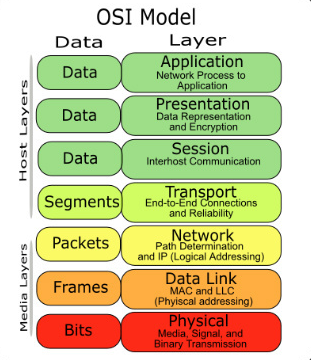

## Network

#### OSI 7 Layer

  컴퓨터 네트워크 소프트웨어의 개발을 돕기 위해서 7계층으로 나누어 정의한 명세서 

​    Layering하는 이유 : 복잡한 시스템을 기능 별로 단순화함 

1. 물리 계층
2. 데이터링크 계층
3. 네트워크 계층
4. 전송 계층
5. 세션 계층
6. 표현 계층
7. 응용 계층

### Socket

- soket 은 소프트웨어 인터페이스

#### ARP(Address Resolution Protocol)

- 주소 결정 프로토콜, 네트워크 상에서 IP 주소와 MAC 주소를 매핑하기 위해서 사용한다.

- ARP는 요청과 응답으로 구성된 프로토콜로 "라우팅되지 않는" 단일 네트워크에서만 작동하는 프로토콜이다. OSI7 계층의 2 계층 프로토콜로 볼 수 있겠는데, IP와 MAC 주소를 캡슐화하기 때문에 L2와 L3 사이에 있는 프로토콜로 묘사하기도 한다. 어쨋거나 ARP는 OSI 프레임워크에서 개발하는 프로토콜은 아니다.

  [참고](https://www.joinc.co.kr/w/man/12/ARP)

