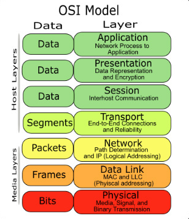

## Network

#### OSI 7 Layer

  컴퓨터 네트워크 소프트웨어의 개발을 돕기 위해서 7계층으로 나누어 정의한 명세서 

​    Layering하는 이유 : 복잡한 시스템을 기능 별로 단순화함 

1. 물리 계층 : 
   - 디지털 --> 아날로그
2. 데이터링크 계층 :
   - 물리적인 네트워크 장비를 일대일(Point to Point)로 신뢰성 있는 통신을 보장하기 위한 명세를 정의
3. 네트워크 계층
   - 노드와 노드를 연결해서 네트워크를 구성하기 위한 프로토콜이 정의되어 있는 계층,  망(네트워크)를 구성하기 위해서는 전체 네트워크에서 노드가 유일해야 한다. 네트워크에서 노드를 식별하기 위해서 사용하는 대표적인 프로토콜이 [IP(Internet Protocol)](https://www.joinc.co.kr/w/man/12/IP)이다.
4. 전송 계층
5. 세션 계층
6. 표현 계층
7. 응용 계층

####Socket

- soket 은 소프트웨어 인터페이스

#### TCP vs UDP

- TCP
  - 신뢰성있는 통신
  - 연결 중심
- UDP
  - 신뢰성없는 통신
  - connectionless
  - 예 : streaming multimedia apps (loss tolerant, rate sensitive), DNS
  - 왜? 빠름, 단순(커넥션 맺는 과정이 없으므로), Lightweight(헤더 사이즈가 작음, Congestion/flow control없음 )

#### HTTP

- TCP사용
- 연결방법
  - non-persistent HTTP
    - HTTP1.0에서 사용
  - persistent HTTP
    - HTTP1.1에서 사용

#### Cookie vs Session

- Cookie 
  - 저장위치 : 클라이언트
  - 저장형식 : Text
  - 크기 제한있음
- Session
  - 저장위치: 서버
  - 저장형식: Object형식

#### 신뢰성 있는 UDP 통신

순서를 보장하는 방법은 패킷에 번호를 붙이고, 번호순서대로 패킷이 도착할때까지 기다렸다가 패킷이 모두 모이면 그때 패킷을 풀면됩니다.  

도착을 보장하는 방법은 패킷에 번호를 붙이고, 해당 번호의 패킷이 도착할때까지 재전송하면 됩니다. 

보내는 입장에서 재전송을 하는 이유는, UDP이기에 받는 입장에서는 자신에게 보내려는 패킷이 있었는지 알 방법이 없기 때문이죠. 

무결성을 보장하는 방법은 체크섬을 통해서, 데이터가 손실되지 않았는지 검증합니다. 

####DNS

> Domain Name System,  
>
> **distributed database** implemented in hierarchy of many name servers  
> **application-layer protocol:** hosts, name servers employ DNS to translate host names into IP addresses

#### Addressing processes

>  identifier includes both **IP address** and **port numbers** associated with process on host.

#### ARP(Address Resolution Protocol)

- IP주소 기반으로 MAC주소를 알아오는 프로토콜
- 주소 결정 프로토콜, 네트워크 상에서 IP 주소와 MAC 주소를 매핑하기 위해서 사용한다.

- ARP는 요청과 응답으로 구성된 프로토콜로 "라우팅되지 않는" 단일 네트워크에서만 작동하는 프로토콜이다. OSI7 계층의 2 계층 프로토콜로 볼 수 있겠는데, IP와 MAC 주소를 캡슐화하기 때문에 L2와 L3 사이에 있는 프로토콜로 묘사하기도 한다. 어쨋거나 ARP는 OSI 프레임워크에서 개발하는 프로토콜은 아니다.

  [참고](https://www.joinc.co.kr/w/man/12/ARP)

#### DHCP

​	

####  100만개의 글(documents)이 있는 게시판에서 User가  “Buying a Home” 이라고 검색을 효율적으로 하려면?

- 색인 	
  - ​

- 역색인( inverted index)
  - ​